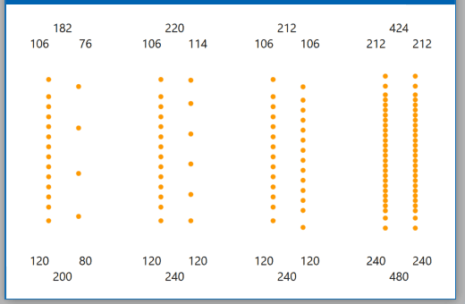
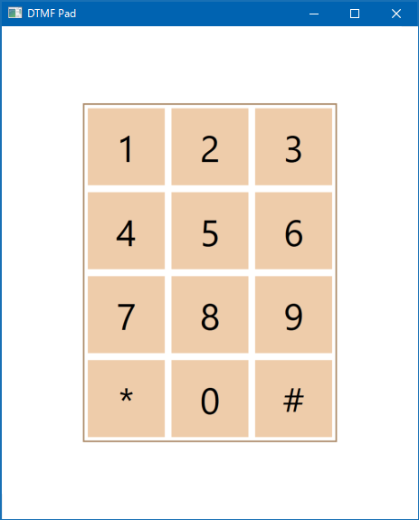

# Tools 2016

The project to create tools.

## Intelli-RPS for Leap Motion
Intelli-RPS is a desktop app to play Rock-paper-scissors (RPS) with a little clever computer, using Leap Motion Controller.  
[Download and install the app](https://sakapon.github.io/Tools/2016/IntelliRpsLeap/IntelliRpsLeap.application) by ClickOnce.  
See [video on Vine](https://vine.co/v/5ZMOK2M1UHi).

## Escalator Simulator
Escalator Simulator is a desktop app to simulate people's stopping or walking on escalators.  
See [video on YouTube](https://www.youtube.com/watch?v=Z5gYF_W0F6k).

## DTMF Pad
DTMF Pad is a desktop app to sound [DTMF (Dual-Tone Multi-Frequency)](https://en.wikipedia.org/wiki/Dual-tone_multi-frequency_signaling) signals, such as a telephone keypad.

## File Splitter
File Splitter is a command line tool to split the specified file, by specifying the maximum file size.  
See [document](https://github.com/sakapon/Tools-2016/wiki/File-Splitter).

## File Replacer
File Replacer is a command line tool to replace names of files or directories, and replace text in files.  
See [document](https://github.com/sakapon/Tools-2016/wiki/File-Replacer).

## Thanks
### Images
- [無料イラスト素材集ほらぱれっと](http://illust-hp.com/)
